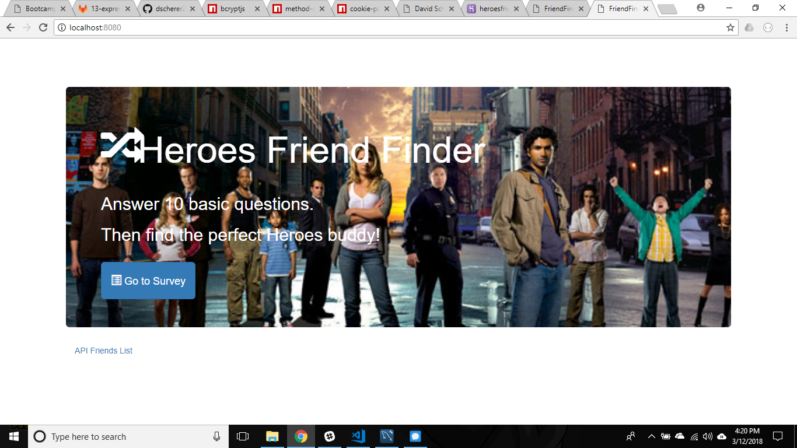

# friendfinder

In this app you will be asked a series of questions. Depending on your answers you will paired another person. Your name and answers will stored in the database and anyone that answeres similarly will be paired with you. There is already 8 people characters from the hit tv series Heroes stored in the Database.

Technologies used include: HTML5, CSS3, JavaScript, Bootstrap 3, ExpressJS, Body-Parser, Self-made API, JSON, NodeJS, NPM, and Path NPM package. 

The site is deployed to Heroku at https://heroesfriendfinder.herokuapp.com/.

